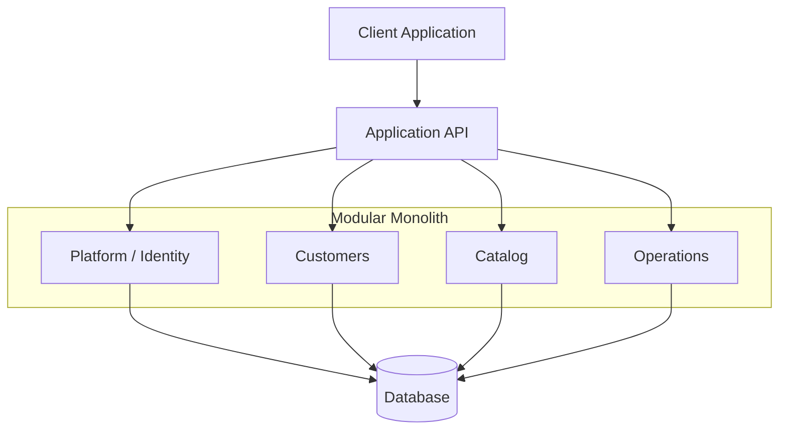
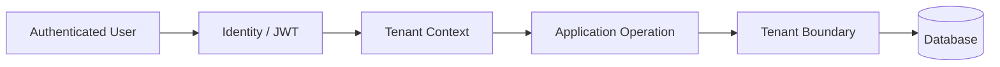
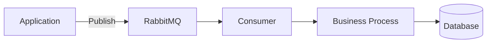
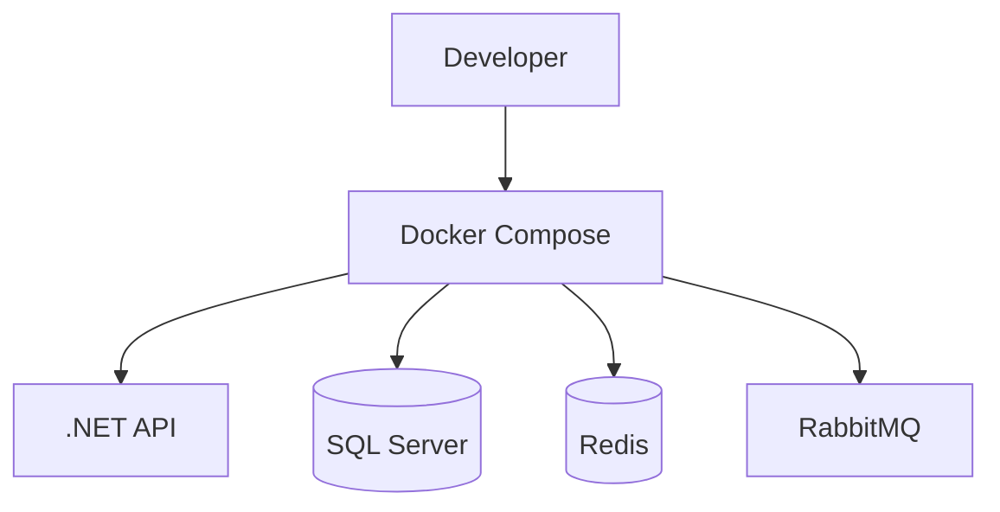

# Software Architecture

This section documents the architectural principles, patterns and engineering decisions that influence the systems presented in this portfolio.

The goal is not to advocate for a single architecture or pattern.

Instead, the focus is on understanding **trade-offs, system boundaries, maintainability and the appropriate level of complexity for each product**.

---

## Architecture Philosophy

I prefer architecture that makes software easier to:

* Understand
* Maintain
* Test
* Evolve
* Operate

Architecture should support the product rather than become an objective by itself.

A technically sophisticated solution is not necessarily a better solution if it introduces complexity without providing a meaningful benefit.

For that reason, my approach favors:

> **Clear boundaries, explicit responsibilities and pragmatic engineering decisions.**

---

# Core Principles

## 1. Explicit Boundaries

Business capabilities should have clearly defined responsibilities.

Instead of allowing every part of the application to depend directly on every other part, dependencies should be intentional.

Conceptually:

```text
Application
│
├── Identity
├── Customers
├── Catalog
├── Scheduling
├── Operations
└── Financial
```

Each area should understand:

* what it owns;
* what it exposes;
* what it consumes;
* what other modules are allowed to access.

The objective is to reduce accidental coupling as the application grows.

---

## 2. Domain Ownership

A module should own the business concepts for which it is responsible.

For example:

```text
Customers Module
│
├── Customer
└── Vehicle
```

while:

```text
Catalog Module
│
├── ServiceCategory
├── Service
├── Package
└── PackageService
```

A different module may reference a customer or service when necessary, but it should not automatically take ownership of that entity's behavior.

This distinction becomes increasingly important as the system evolves.

---

## 3. Controlled Dependencies

Dependencies between modules should be explicit and preferably directional.

Instead of creating large interconnected object graphs:

```text
Module A
   ↕
Module B
   ↕
Module C
   ↕
Module D
```

the preferred model is closer to:

```text
Module A ───► Contract
                │
                ▼
             Module B
```

Communication can happen using:

* identifiers;
* explicit contracts;
* application services;
* commands;
* queries;
* domain or integration events when appropriate.

This helps prevent changes in one module from propagating unnecessarily throughout the entire application.

---

# Modular Monolith

One architectural approach used in my projects is the **modular monolith**.

A modular monolith maintains a single application deployment while introducing explicit internal boundaries between business capabilities.

Conceptually:



The application is deployed as one system, but internally it is organized around independent responsibilities.

---

## Why not start with Microservices?

Microservices can be valuable when a system requires capabilities such as:

* independent deployments;
* independent scaling;
* separate engineering teams;
* different infrastructure requirements;
* strong process isolation;
* independent release cycles.

However, they also introduce significant additional complexity.

For example:

```text
Microservices
│
├── Network communication
├── Service discovery
├── Distributed tracing
├── Message delivery guarantees
├── Distributed transactions
├── Independent deployments
├── Data synchronization
├── Failure handling
└── Additional infrastructure
```

Introducing this complexity before the product actually requires it can slow development considerably.

Therefore, my preferred approach is:

> **Start with strong boundaries inside a simpler deployment model and distribute components only when there is a concrete reason to do so.**

A well-designed modular monolith can provide many of the organizational benefits associated with microservices without immediately introducing distributed-system complexity.

---

# Layer Responsibilities

Applications can also separate responsibilities vertically.

A simplified conceptual structure might look like:

```text
Presentation
     │
     ▼
Application
     │
     ▼
Domain
     │
     ▼
Infrastructure
```

Each layer has a different responsibility.

---

## Presentation

Responsible for interaction with external consumers.

Examples:

```text
ASP.NET Core Controllers
REST APIs
Blazor Applications
HTTP Contracts
Authentication Entry Points
```

The presentation layer should not become the location for complex business rules.

---

## Application

Responsible for coordinating use cases.

Examples:

```text
Commands
Queries
Handlers
Application Services
Validation
Authorization checks
```

The application layer defines **what the application can do**.

---

## Domain

Responsible for business behavior and business concepts.

Examples:

```text
Entities
Value Objects
Domain Rules
Business Invariants
Domain Services
```

The domain should represent the important rules of the problem being solved rather than infrastructure concerns.

---

## Infrastructure

Responsible for technical implementation details.

Examples:

```text
Entity Framework Core
SQL Server
Redis
RabbitMQ
External APIs
File storage
Email providers
```

Infrastructure enables application capabilities but should not define the business model.

---

# CQRS

Some applications in this portfolio use concepts from **Command Query Responsibility Segregation**.

The basic idea is to distinguish operations that change state from operations that retrieve information.

```text
Request
  │
  ├── Command ──► Change application state
  │
  └── Query ────► Retrieve information
```

Example:

```text
CreateCustomerCommand
UpdateVehicleCommand
DeleteServiceCommand

GetCustomerByIdQuery
GetVehiclesQuery
GetServiceCatalogQuery
```

This separation can improve readability and make complex application flows easier to reason about.

However, CQRS should not automatically imply:

* separate databases;
* event sourcing;
* distributed services.

It can be used pragmatically inside a traditional application architecture.

---

# Data Access

Entity Framework Core is commonly used as the persistence abstraction in the .NET applications presented here.

A typical flow is:

```text
Application Use Case
        │
        ▼
Repository / Data Access
        │
        ▼
Entity Framework Core
        │
        ▼
Relational Database
```

Depending on the application, repositories can be introduced when they provide meaningful abstraction around aggregate or persistence behavior.

The goal is not to wrap Entity Framework simply for the sake of adding another layer.

Abstractions should exist because they provide value.

---

# Multi-Tenant Architecture

For SaaS systems, tenant isolation is a fundamental architectural concern.

A simplified request flow can be represented as:



Tenant ownership must be validated by the backend.

It is not enough to hide records from the frontend.

Typical tenant-owned data may include:

```text
Company
│
├── Customers
├── Vehicles
├── Services
├── Packages
├── Schedules
├── Financial Records
└── User Preferences
```

Every relevant operation should preserve that ownership boundary.

---

# Authentication and Authorization

Authentication answers:

> **Who is the user?**

Authorization answers:

> **What is the user allowed to do?**

These concerns should remain distinct.

A common architecture is:

```text
Login
  │
  ▼
Authentication
  │
  ▼
Identity established
  │
  ▼
Tenant context
  │
  ▼
Permissions
  │
  ▼
Application operation
```

For systems requiring flexible access control, permission-based authorization can be more expressive than relying exclusively on fixed roles.

For example:

```text
Profile: Manager

Permissions:
├── customers.view
├── customers.create
├── customers.update
├── services.view
├── services.update
└── financial.view
```

This allows access policies to evolve without creating dozens of increasingly specific roles.

---

# Messaging & Asynchronous Processing

Not every operation needs to execute synchronously during an HTTP request.

Systems may benefit from asynchronous processing when dealing with:

* integrations;
* notifications;
* financial processing;
* long-running operations;
* events;
* retries;
* workflows between modules.

Technologies I work with in this area include:

```text
RabbitMQ
MassTransit
Hangfire
```

A simplified asynchronous flow:



Messaging should be introduced when asynchronous communication provides a concrete benefit rather than simply because a message broker is available.

---

# External Integrations

External systems should be treated as unreliable dependencies.

An integration may fail because of:

* network issues;
* timeouts;
* unavailable services;
* invalid responses;
* rate limits;
* duplicated requests.

For that reason, integrations should consider concerns such as:

```text
Validation
Timeouts
Retries
Idempotency
Logging
Observability
Error handling
State reconciliation
```

The application should avoid allowing external implementation details to spread directly into domain logic.

A useful conceptual boundary is:

```text
Application
     │
     ▼
Integration Contract
     │
     ▼
Provider Adapter
     │
     ▼
External API
```

This reduces coupling between business rules and individual providers.

---

# Background Processing

Some operations should be executed outside the main HTTP request lifecycle.

Examples include:

```text
Scheduled jobs
Payment reconciliation
Recurring operations
Notifications
Data synchronization
Batch processing
```

A simplified architecture:

```text
Scheduler
   │
   ▼
Background Job
   │
   ▼
Application Service
   │
   ▼
Business Rules
   │
   ▼
Persistence / Integration
```

Tools such as **Hangfire** can provide scheduling, retry handling and execution visibility for these workloads.

---

# Caching

Caching can improve performance and reduce unnecessary external or database access.

Technologies such as **Redis** can be used for:

* permission caching;
* user context;
* frequently accessed data;
* distributed application state;
* temporary application data.

However, introducing cache creates another important problem:

> **Cache invalidation.**

For this reason, caching should be applied intentionally rather than automatically.

The application must define:

* what is cached;
* how long it remains valid;
* when it is invalidated;
* what happens when Redis is unavailable.

---

# Observability

Production software needs to explain what it is doing.

An application should provide enough information to understand:

```text
What happened?
Where did it happen?
Why did it fail?
How often is it failing?
How long did it take?
Which dependency was involved?
```

Observability can include:

```text
Structured Logs
Metrics
Tracing
Health Checks
Dashboards
Alerts
```

Technologies I work with or explore in this area include:

```text
Prometheus
Grafana
Application logs
Container metrics
Cloud monitoring
```

---

# Infrastructure

Modern applications should be reproducible across environments.

Containerization can help create consistent development and deployment environments.

A simplified local environment may look like:



Not every application requires all of these dependencies.

The infrastructure should remain proportional to the actual requirements of the system.

---

# CI/CD

Application delivery should be repeatable and automated whenever possible.

A typical pipeline can include:

```text
Commit / Pull Request
        │
        ▼
Restore dependencies
        │
        ▼
Build
        │
        ▼
Run tests
        │
        ▼
Static validation
        │
        ▼
Build artifact/container
        │
        ▼
Deploy
```

CI/CD reduces manual deployment steps and creates a consistent quality gate before software reaches an environment.

---

# Architectural Trade-offs

Architecture is primarily about trade-offs.

Examples include:

| Decision             | Benefit                         | Cost                                                     |
| -------------------- | ------------------------------- | -------------------------------------------------------- |
| Modular Monolith     | Simpler operations              | Requires discipline around module boundaries             |
| Microservices        | Independent deployment          | Distributed-system complexity                            |
| CQRS                 | Explicit application flows      | Additional classes and structure                         |
| Messaging            | Decoupling and async processing | Eventual consistency and operational complexity          |
| Redis                | Performance                     | Cache invalidation and another infrastructure dependency |
| Docker               | Reproducibility                 | Container configuration and operational knowledge        |
| Granular permissions | Flexible authorization          | More complex access-control model                        |

The right decision depends on the context of the system.

---

# Evolution Over Perfection

Software architecture is not static.

Products change.

Business rules evolve.

User expectations change.

Infrastructure requirements grow.

Because of that, I prefer architectures that allow **incremental evolution**.

A system may start as:

```text
Modular Monolith
```

and eventually evolve toward:

```text
Modular Monolith
       │
       ├── Background Workers
       │
       ├── Dedicated Integrations
       │
       └── Extracted Services
```

only when there is a clear technical or business reason.

The objective is not to predict every future requirement.

The objective is to make today's decisions without unnecessarily blocking tomorrow's evolution.

---

# Architecture Case Studies

The principles documented here can be seen in practice in the projects included in this portfolio.

### Detara

Automotive Services Management SaaS built with:

`C#` · `.NET 10` · `ASP.NET Core` · `Blazor WebAssembly` · `MudBlazor` · `Entity Framework Core` · `SQL Server` · `Docker`

Key architecture topics:

* Modular Monolith
* Multi-Tenancy
* Module Ownership
* Permission-Based Authorization
* SaaS Architecture
* Explicit Domain Boundaries

[View Detara Case Study →](../case-studies/detara/README.md)

---

## Final Principle

The architectural principle behind the work documented in this portfolio can be summarized as:

> **Use enough architecture to keep the system maintainable and evolvable, but not so much architecture that the architecture itself becomes the problem.**
