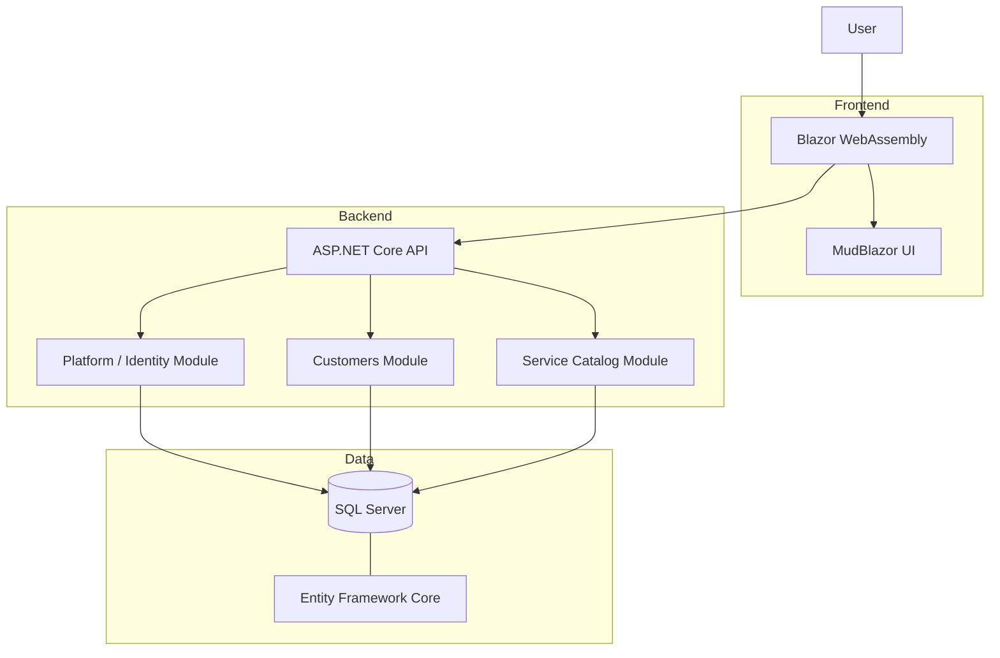
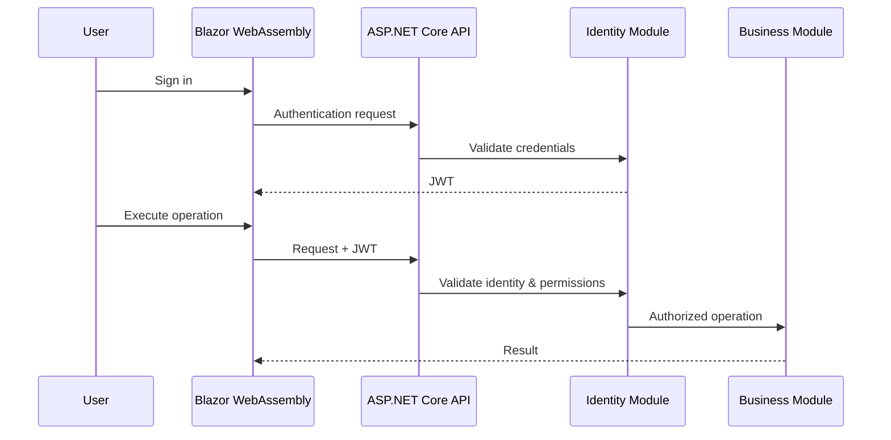

# Detara

### Automotive Services Management SaaS

> Architecture and engineering case study for a commercial SaaS product.

---

## Overview

**Detara** is a SaaS platform designed for automotive detailing and vehicle care businesses.

The product aims to centralize the operational management of a business through modules covering customers, vehicles, service catalogs, packages and, progressively, other areas of the operation.

Detara is developed as a commercial product, therefore its source code is maintained in a **private repository**.

This case study documents the architecture, technologies and engineering decisions behind the platform without exposing proprietary implementation details.

---

## The Problem

Automotive service businesses commonly need to manage information that is distributed across spreadsheets, messaging applications and disconnected tools.

A management platform for this market needs to handle entities such as:

* Customers
* Vehicles
* Services
* Service categories
* Service packages
* Users
* Permissions
* Company-specific configurations

As the product grows, additional operational areas can be introduced without turning the application into a tightly coupled system.

This requirement strongly influenced Detara's architecture.

---

## Product Goals

The technical architecture was designed around a few important goals:

* Support multiple companies using the same platform
* Maintain strict isolation between tenant data
* Allow the product to evolve incrementally
* Keep business modules explicitly separated
* Avoid premature microservice complexity
* Maintain a responsive and professional user experience
* Allow future modules to be introduced without major architectural rewrites

---

## Current Architecture Status

The architectural foundation of Detara is already implemented and actively evolving.

The platform currently includes the foundational capabilities for:

- Company and tenant management
- Users and profiles
- Permission-based authorization
- User preferences
- Customers
- Vehicles
- Service categories
- Services
- Service packages
- Multi-tenant data isolation
- JWT-based authentication
- Responsive Blazor application shell
- Light and dark themes
- Containerized local development environment

The current business modules are organized around:

```text
Detara
│
├── Platform / Identity
│   ├── Companies
│   ├── Users
│   ├── Profiles
│   ├── Permissions
│   └── Preferences
│
├── Customers
│   ├── Customers
│   └── Vehicles
│
└── Catalog
    ├── Service Categories
    ├── Services
    └── Packages
```

# Architecture

Detara currently follows a **modular monolith architecture**.

Instead of dividing the system into microservices early in the product lifecycle, the application maintains a single deployable backend while enforcing explicit boundaries between business modules.



---

# Why a Modular Monolith?

Microservices can provide strong isolation and independent deployment, but they also introduce additional operational complexity.

For the current stage of Detara, this would include unnecessary overhead involving:

* Distributed communication
* Service discovery
* Multiple deployments
* Distributed transactions
* Additional observability requirements
* Infrastructure management
* Data synchronization

Instead, Detara uses a modular monolith.

This provides a simpler operational model while preserving architectural boundaries that can support future evolution.

The intention is not to create a monolith without structure.

Each module is designed to have clear responsibilities and ownership over its own business concepts.

---

# Module Boundaries

Current architectural areas include:

```text
Detara
│
├── Platform / Identity
│
│   ├── Companies
│   ├── Users
│   ├── Authentication
│   ├── Authorization
│   └── User preferences
│
├── Customers
│   ├── Customers
│   └── Vehicles
│
└── Catalog
    ├── Service categories
    ├── Services
    └── Service packages
```

Each module owns its domain concepts.

Cross-module dependencies are intentionally limited.

Instead of building large interconnected Entity Framework navigation graphs, modules communicate primarily through identifiers, explicit contracts and controlled application boundaries.

---

# Multi-Tenancy

Detara is designed as a multi-tenant SaaS application.

Multiple businesses can use the platform while sharing the same application infrastructure.

Tenant isolation is therefore treated as an architectural concern rather than something handled only by the user interface.

Conceptually:

```text
Authenticated User
        │
        ▼
     Company
        │
        ▼
 Tenant Context
        │
        ▼
 Application Operations
        │
        ▼
 Tenant-filtered Data
```

Business data belongs to a specific company and application operations must respect that context.

Examples include:

* Customers
* Vehicles
* Service categories
* Services
* Packages
* User preferences

This reduces the risk of data from one company being accessed by another tenant.

---

# Authentication & Authorization

Authentication is handled using **JWT-based authentication**.

After authentication, the application determines the user's identity, company context and permissions.

Authorization is permission-oriented rather than relying exclusively on broad roles.

This provides more flexibility as the SaaS evolves.

A simplified authorization flow looks like:



---

# Backend

The backend is built with:

* **.NET 10**
* **ASP.NET Core Web API**
* **C#**
* **Entity Framework Core 10**
* **SQL Server**

The backend is responsible for:

* Authentication
* Authorization
* Tenant isolation
* Business rules
* Data persistence
* Application module boundaries
* API contracts

---

# Frontend

The frontend uses:

* **Blazor WebAssembly**
* **MudBlazor**

Blazor allows the application to use C# across both backend and frontend while MudBlazor provides the component foundation for the interface.

The frontend was designed with a strong focus on operational usability.

Some UI concerns include:

* Responsive layouts
* Desktop and mobile navigation
* Light and dark themes
* Persistent user preferences
* Favorite pages
* Internationalization support
* Consistent design system

The goal is to avoid the appearance of a generic administrative dashboard while maintaining productivity for everyday business operations.

---

# Data Architecture

Persistence is handled primarily with:

```text
ASP.NET Core
      │
      ▼
Entity Framework Core
      │
      ▼
SQL Server
```

Entity Framework migrations are used to evolve the database schema together with the application.

Domain relationships are intentionally designed to avoid uncontrolled coupling between modules.

For cross-module relationships, the architecture favors explicit identifiers and contracts over deep navigation structures.

---

# Development Environment

The local development environment is containerized using Docker.

The main development services currently include:

```text
Docker Compose
│
├── SQL Server
│
└── Detara API
```

This allows developers to reproduce the environment without manually configuring infrastructure dependencies.

The application can therefore be initialized from a consistent environment using version-controlled configuration.

---

# Engineering Decisions

## Modular Monolith instead of Microservices

**Decision**

Start with a modular monolith.

**Reason**

The application is still evolving rapidly and does not currently require independent service deployment.

**Benefit**

Lower infrastructure complexity while maintaining explicit domain boundaries.

---

## Explicit Module Ownership

**Decision**

Each business module owns its data and domain responsibilities.

**Reason**

Uncontrolled relationships between modules gradually create tightly coupled systems.

**Benefit**

Modules can evolve with fewer unintended dependencies.

---

## Multi-Tenancy as a Core Concern

**Decision**

Tenant isolation is enforced throughout application operations.

**Reason**

Tenant filtering implemented only at UI level would not provide sufficient data protection.

**Benefit**

Company isolation becomes part of the application's architecture.

---

## Permission-Based Authorization

**Decision**

Use granular permissions in addition to user profiles.

**Reason**

Commercial SaaS applications often need different permission combinations for different employees.

**Benefit**

Authorization can evolve without creating an excessive number of predefined roles.

---

## Commercial Snapshots

Some information can change over time while historical business records must preserve their original state.

For these cases, the architecture can use snapshots rather than relying exclusively on references to mutable catalog entities.

Example:

```text
Service Catalog
Price: R$ 100

          │
          ▼

Service performed
Stored price: R$ 100

          │
Catalog price later changes
          ▼

Service Catalog
Price: R$ 120

Historical transaction
Price remains: R$ 100
```

This prevents historical operations from changing when catalog information is updated.

---

# Product Evolution

The current foundation already supports customers, vehicles and service catalog management.

The product architecture is being prepared to progressively support areas such as:

```text
Detara
│
├── Customers & Vehicles
├── Service Catalog
├── Packages
│
├── Scheduling
├── Service Operations
├── Financial Management
│
├── Inventory
└── CRM
```

The last modules are expected to evolve as the product matures and market requirements become clearer.

---

# Key Engineering Challenges

Building Detara involves several interesting technical challenges:

### Tenant isolation

Ensuring all business operations respect company ownership.

### Architecture evolution

Maintaining module boundaries while continuously adding functionality.

### Product flexibility

Supporting different automotive businesses without embedding excessive customer-specific rules into the product.

### Historical consistency

Preserving commercial information even when catalog entities change.

### Authorization

Providing flexible access control without creating an unmanageable role model.

### User experience

Balancing operational density with a clean and professional interface.

---

# Technologies

### Application

`C#`
`.NET 10`
`ASP.NET Core`
`Blazor WebAssembly`
`MudBlazor`

### Data

`Entity Framework Core 10`
`SQL Server`

### Security

`JWT Authentication`
`Permission-based Authorization`
`Tenant Isolation`

### Infrastructure

`Docker`
`Docker Compose`

### Architecture

`Modular Monolith`
`Module Boundaries`
`Domain Ownership`
`CQRS concepts`
`Explicit Contracts`

---

# Source Code

Detara is an active commercial software product.

Its source code is therefore maintained privately.

This case study intentionally focuses on the architectural and engineering aspects of the project while excluding:

* proprietary implementation details;
* credentials;
* customer data;
* internal infrastructure information;
* sensitive business rules.

---

## Status

🟢 **Active Development**

The platform is currently evolving through incremental modules and architecture improvements.
